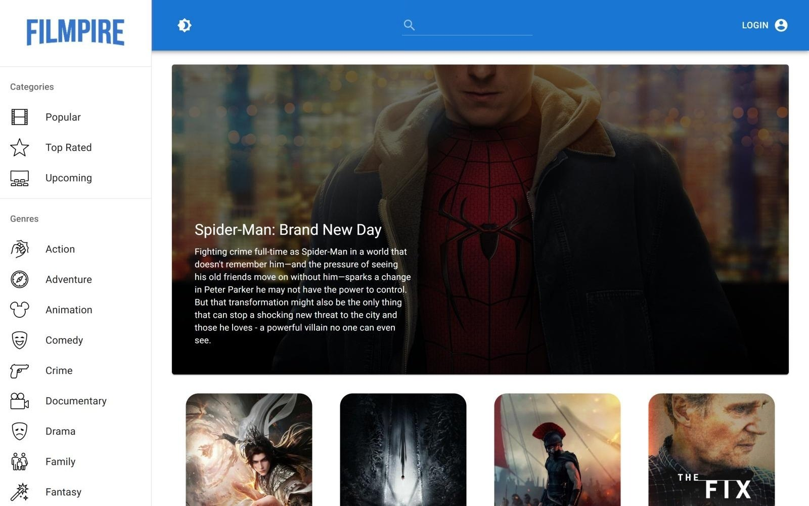
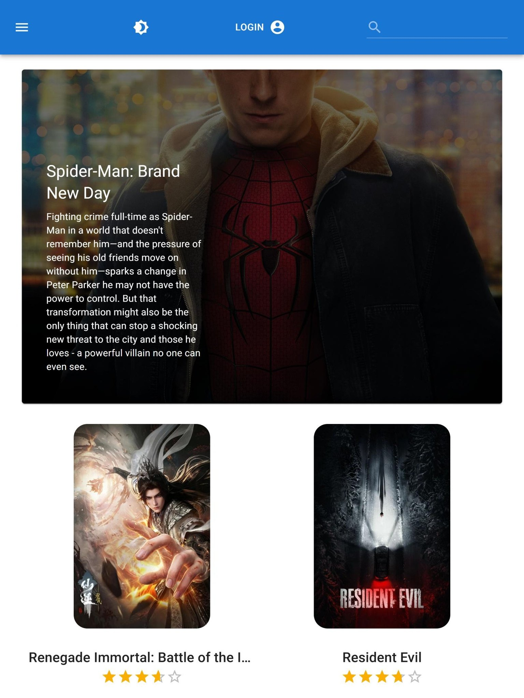
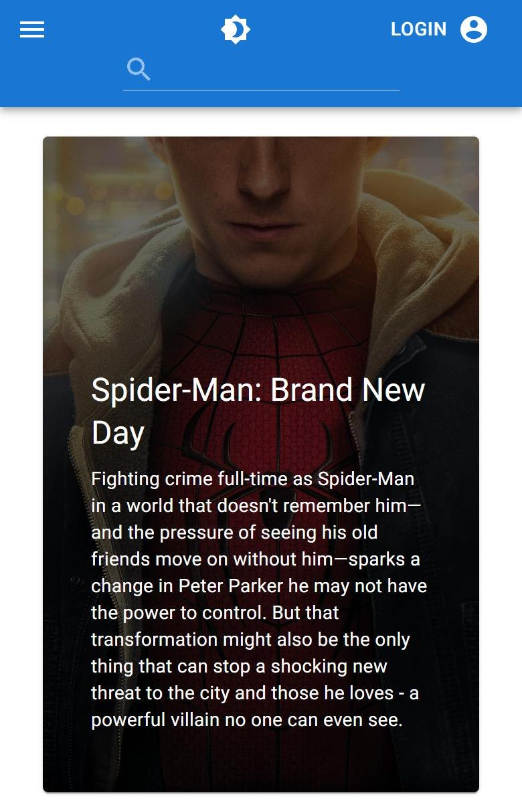

# Filmpire

**A movie discovery app built on The Movie Database (TMDB) API**

**[View the live site](https://filmpire-sbirmingham.netlify.app/)**

  

  
  &nbsp;
  

## About

Filmpire lets you browse, search, and save movies using live data from TMDB. I built it by following a JavaScript Mastery course, as practice with Redux Toolkit, RTK Query, and Material UI in a larger React app.

## Features

- **Browse** popular, top-rated, and upcoming movies, or filter by any of TMDB's genres from the sidebar
- **Search** for any title, with paginated results
- **Movie pages** with the rating, runtime, languages, genres, overview, top cast, a trailer, links to the official site and IMDb, and recommended movies
- **Actor pages** with a short biography and the movies they've appeared in
- **Sign in with a TMDB account** to favorite movies and add them to a watchlist, then see both on your profile page
- **Light and dark mode**
- **Voice assistant** powered by Alan AI: say a genre, search for a movie, switch the theme, or log in and out hands-free
- **Responsive layout**: on smaller screens the sidebar collapses into a slide-out menu

## How it works

- **Data fetching:** every TMDB request goes through RTK Query, which handles loading states and caches results, so returning to a page doesn't refetch it.
- **State:** Redux Toolkit slices hold the selected genre or category, the current search, and the signed-in user.
- **Sign-in:** uses TMDB's authentication flow. The app requests a token, the user approves it on TMDB, and the app exchanges it for a session ID that's used to read and update their favorites and watchlist.
- **Theming:** a React context switches Material UI between light and dark themes.
- **Routing:** React Router handles the home, movie, actor, and profile pages.

## Built with

React 18 · Redux Toolkit and RTK Query · React Router 6 · Material UI 5 · Axios · TMDB API · Alan AI · Netlify

## Credits

Built by following JavaScript Mastery's Filmpire course. Movie data and images come from [TMDB](https://www.themoviedb.org/). This product uses the TMDB API but is not endorsed or certified by TMDB.

---

Made by [Sean Birmingham](https://sbirmingham.dev) · [LinkedIn](https://www.linkedin.com/in/sean-birmingham) · [GitHub](https://github.com/sean-birmingham)
